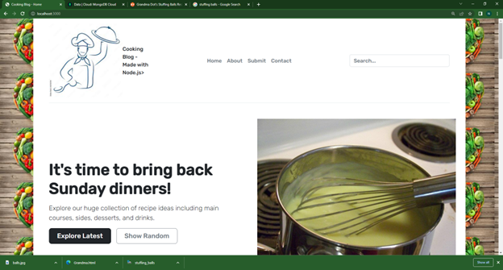

This is a recipe blog. Built with Nodejs. The blog displays recipes according to five different categories, with the most recent for each category being displayed on the homepage. The five most recent additions overall are displayed in their own section of the home page. There is a submission page for users to submit their own recipes. The collection of recipes is managed by MongoDB. 
